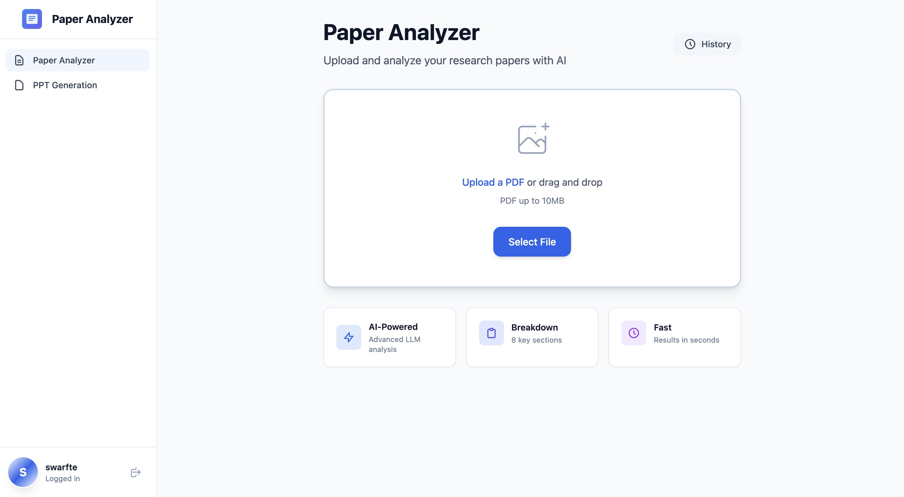
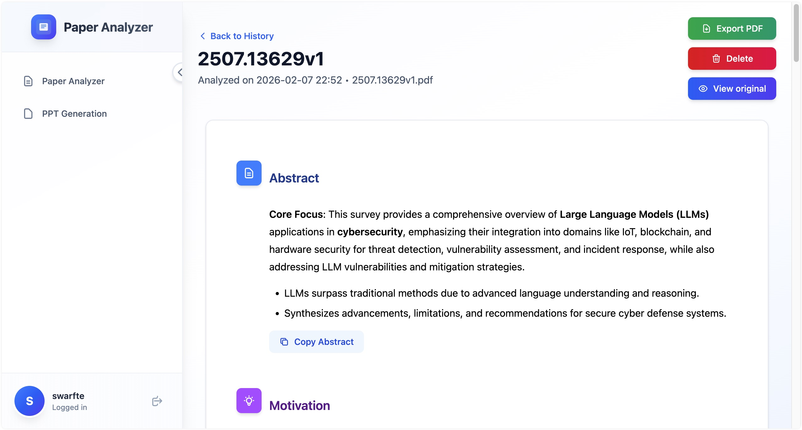
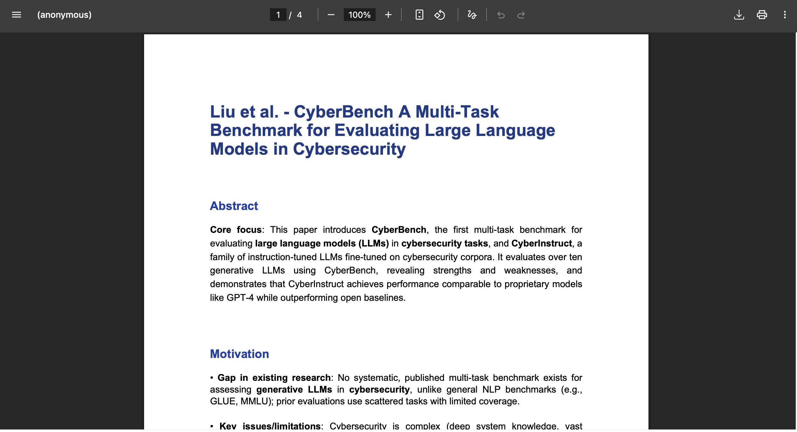

# Paper Analyzer

[](https://www.python.org/downloads/)
[](https://www.djangoproject.com/)
[](LICENSE)

> **Note:** If the README is not rendering properly on GitHub, please refresh the page or clear your browser cache.

> AI-powered research paper analyzer that extracts key insights from academic papers using advanced language models.

Paper Analyzer helps researchers, students, and academics quickly understand and summarize research papers. Upload a PDF, and the application will automatically extract the abstract, motivation, contributions, methodology, results, limitations, and conclusions using state-of-the-art LLMs via OpenRouter.



## Features

### Current Features (Paper Analysis)

- **PDF Upload & Analysis**: Upload research papers in PDF format (up to 10MB)
- **AI-Powered Insights**: Leverages multiple LLM models through OpenRouter for intelligent analysis
- **Comprehensive Extraction**: Automatically extracts:
  - Abstract
  - Research Motivation
  - Key Contributions
  - What the paper does (Experiments & Results)
  - How the paper works (Methodology)
  - Limitations & Challenges
  - Future Work
  - Conclusion

- **Full Scrollable Report View**: Analysis results displayed in an easy-to-read document format with markdown rendering
- **PDF Export**: Export complete analysis reports to professionally formatted PDF files
- **Collapsible Sidebar**: Space-saving sidebar with toggle button and smart tooltips
- **Analysis History**: View all your previously analyzed papers
- **Search Functionality**: Quickly find papers by title, filename, or abstract
- **Progress Tracking**: Real-time progress bar and ETA during analysis
- **Copy to Clipboard**: Quick copy buttons for each analysis section
- **User Authentication**: Secure login system for personalized experience
- **Responsive Design**: Modern UI with Vue 3, Tailwind CSS, and HTMX

### Upcoming Features (PPT Generation)

- Generate PowerPoint presentations from paper analysis
- Customizable slide templates
- Export to various formats (PPTX, PDF)
- One-click presentation generation

## Demo

### Analysis Results (Full Report View)


### PDF Export


## Tech Stack

**Backend:**
- Django 6.0.1 - Web framework
- Python 3.14+ - Programming language
- SQLite - Database (default)
- PyPDF2 - PDF text extraction
- OpenAI API Client - LLM integration

**Frontend:**
- Vue 3 (CDN) - Reactive UI framework
- Tailwind CSS v4 - Utility-first CSS
- HTMX 2.0.8 - Dynamic HTML updates
- Vanilla JavaScript - Interactivity

**AI/ML:**
- OpenRouter API - Unified interface for multiple LLMs
- Support for various models (Claude, GPT-4, Gemini, Llama, Mistral, etc.)

## Installation

### Prerequisites

- Python 3.14 or higher
- [uv](https://github.com/astral-sh/uv) (recommended) or pip
- Git

### Quick Start with Setup Script

The easiest way to set up the project is using the automated setup script:

```bash
# 1. Clone the repository
git clone <your-repo-url>.git
cd paper-analyzer

# 2. Create .env file from the example
cp .env.example .env

# 3. Edit .env and fill in the required values:
#    - DJANGO_SECRET_KEY (required)
#    - OPENROUTER_API_KEY (for paper analysis)
#    - ADMIN_USERNAME (for admin account)
#    - ADMIN_PASSWORD (for admin password)

# 4. Run the setup script
uv run setup.py

# 5. Start the development server
uv run manage.py runserver

# 6. Open your browser
#    http://localhost:8000
```

### Manual Installation

If you prefer to set up manually:

```bash
# 1. Install dependencies
uv sync

# 2. Create .env file
cp .env.example .env
# Edit .env with your configuration

# 3. Run migrations
uv run manage.py migrate

# 4. Create superuser (optional)
uv run manage.py createsuperuser

# 5. Collect static files
uv run manage.py collectstatic

# 6. Run development server
uv run manage.py runserver
```

## Configuration

Create a `.env` file in the project root with the following variables:

```bash
# Required
DJANGO_SECRET_KEY='your-secret-key-here'           # Django secret key (required)
DJANGO_DEBUG=True                                   # Debug mode

# OpenRouter Configuration (for paper analysis)
OPENROUTER_API_KEY=sk-or-your-api-key              # Get from https://openrouter.ai/keys
LLM_MODEL=x-ai/grok-4.1-fast                       # Choose your preferred model

# Available models:
# - anthropic/claude-3.5-sonnet
# - openai/gpt-4o-mini
# - openai/gpt-4o
# - google/gemini-pro-1.5
# - meta-llama/llama-3.1-70b-instruct
# - mistralai/mistral-large
# - x-ai/grok-4.1-fast

# Admin Account (optional, for setup script)
ADMIN_USERNAME=admin
ADMIN_PASSWORD=adminpassword123

# Paper Analysis Settings
MAX_PDF_SIZE_MB=10                                  # Maximum PDF file size
MAX_TEXT_LENGTH=25000                              # Maximum text length to analyze

# Optional: OpenRouter app information
OPENROUTER_APP_NAME=Paper Analyzer
OPENROUTER_REFERER=http://localhost:8000
```

### Getting an OpenRouter API Key

1. Visit [OpenRouter](https://openrouter.ai/)
2. Sign up or log in
3. Navigate to [API Keys](https://openrouter.ai/keys)
4. Create a new API key
5. Add it to your `.env` file

## Usage

### Analyzing a Paper

1. **Login** to your account at `http://localhost:8000/login/`
2. Navigate to the **Analyzer** page
3. **Upload a PDF**:
   - Click "Choose File" or drag and drop
   - Select your research paper (PDF format, max 10MB)
4. **Click "Analyze Paper"** and wait for the AI to process
   - Progress bar shows real-time analysis progress
   - Estimated time remaining is displayed
5. **View Results** displayed in a full scrollable report:
   - All sections visible at once (no need to click cards)
   - Markdown-formatted content for better readability
   - Copy buttons for each section
   - Export to PDF, view original PDF, or delete analysis

### Viewing Analysis History

1. Click **History** in the sidebar
2. Browse all your analyzed papers with pagination
3. **Search** by title, filename, or abstract
4. Click any paper to view detailed analysis

### Managing Analyses

- **View Full Report**: All sections displayed in scrollable document format
- **Export to PDF**: Download complete analysis as formatted PDF
- **View Original**: Open the original uploaded PDF
- **Delete**: Remove unwanted analyses
- **Copy Sections**: Quick copy buttons for each analysis section

### Admin Panel

Access the Django admin panel at `http://localhost:8000/admin/` to:
- Manage users
- View all paper analyses
- Access database records directly

## Development

### Running Tests

```bash
# Run all tests
uv run manage.py test

# Run tests for the analyzer app
uv run manage.py test analyzer
```

### Database Management

```bash
# Create migrations
uv run manage.py makemigrations

# Apply migrations
uv run manage.py migrate

# Open Django shell
uv run manage.py shell
```

### Creating Superuser

```bash
# Interactive creation
uv run manage.py createsuperuser

# Or use environment variables (in .env)
ADMIN_USERNAME=admin
ADMIN_PASSWORD=secure_password
# Then run: uv run setup.py
```

### Static Files

```bash
# Collect static files for production
uv run manage.py collectstatic
```

## Roadmap

- [x] User authentication system
- [x] PDF upload and parsing
- [x] AI-powered paper analysis
- [x] Analysis history with search
- [x] Detailed analysis view (full scrollable report)
- [x] PDF export functionality
- [x] Progress tracking and ETA
- [x] Collapsible sidebar
- [x] Copy to clipboard for sections
- [ ] PPT generation from analysis
- [ ] Custom slide templates
- [ ] Export to PPTX/PDF
- [ ] Batch analysis support
- [ ] Comparison view for multiple papers
- [ ] Annotation and note-taking
- [ ] Citation export (BibTeX, EndNote)
- [ ] Multi-language support

## Contributing

Contributions are welcome! Please feel free to submit a Pull Request.

1. Fork the repository
2. Create your feature branch (`git checkout -b feature/AmazingFeature`)
3. Commit your changes (`git commit -m 'Add some AmazingFeature'`)
4. Push to the branch (`git push origin feature/AmazingFeature`)
5. Open a Pull Request

## License

This project is licensed under the MIT License - see the [LICENSE](LICENSE) file for details.

## Acknowledgments

- [Django](https://www.djangoproject.com/) - The web framework for perfectionists with deadlines
- [OpenRouter](https://openrouter.ai/) - Unified interface for multiple LLMs
- [Vue.js](https://vuejs.org/) - Progressive JavaScript framework
- [Tailwind CSS](https://tailwindcss.com/) - Utility-first CSS framework
- [HTMX](https://htmx.org/) - High power tools for HTML
- [Marked.js](https://marked.js.org/) - Markdown parser for PDF exports

## Support

If you encounter any issues or have questions:

1. Check the [Documentation](CLAUDE.md)
2. Search existing [Issues](../../issues)
3. Create a new issue with details about your problem

## Changelog

### Version 0.2.0 (Current)
- ✨ **New**: Full scrollable report view for analysis results
- ✨ **New**: PDF export with markdown parsing support
- ✨ **New**: Collapsible sidebar with toggle button and tooltips
- ✨ **New**: Progress tracking with ETA during analysis
- ✨ **New**: Copy to clipboard buttons for each section
- 🎨 **Improved**: Vertical action buttons with color coding (green/red/blue)
- 🎨 **Improved**: Better markdown rendering in reports
- 🐛 **Fixed**: Horizontal scrollbar in collapsed sidebar
- 🔧 **Refactored**: Analysis results from card layout to document format

### Version 0.1.0
- Initial release
- Paper analysis functionality
- User authentication
- Analysis history with search
- Responsive UI with Vue 3 and Tailwind CSS

---

Made with :heart: by the Paper Analyzer Team
